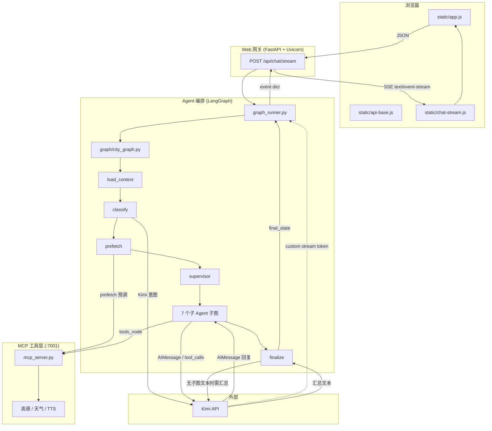
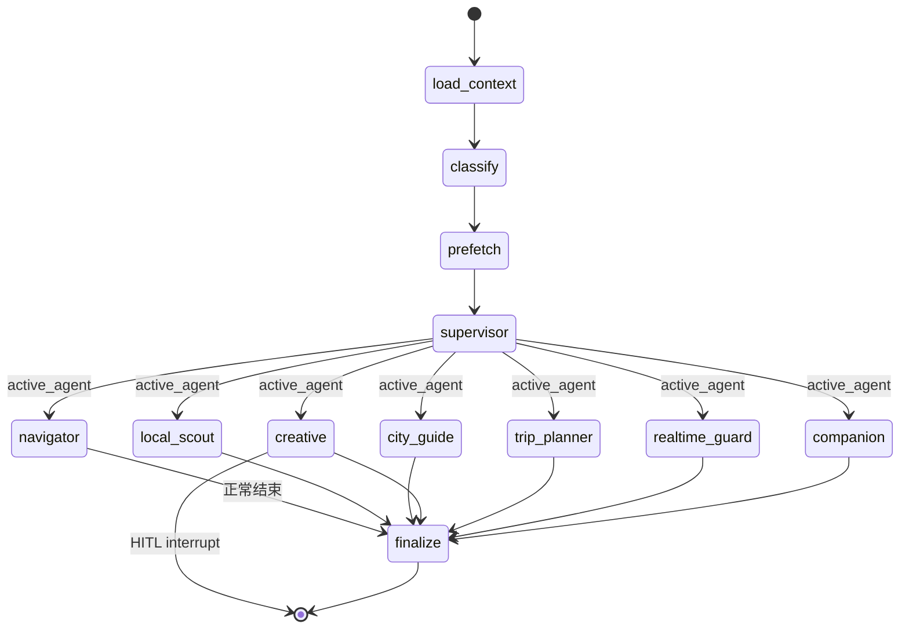

# 一句话到回复 —— 从自然语言到流式文本

> **本课目标**：理解 **NL in → text out** 的完整链路；掌握 Web 网关、SSE **双流**（`updates` + `custom`）、LangGraph 主图骨架；  
> **追踪方法**：从用户输入框里的一句话，**自上而下**追到屏幕上的回复；建议主追踪句：**「查询周边实时路况」**（需先定位）。  
> **实验手册**：本章 **§6** 含 Windows 分步实验、PowerShell 命令、**原理说明** 与 Network 截图位（见 [`scripts/lab-common.ps1`](./scripts/lab-common.ps1)）。

## 1. 课前准备

> 文档总索引与环境变量表见 [`docs/README.md`](../README.md)。

```powershell
# Windows（本项目主要开发环境）
pip install -r requirements.txt
# 配置 .env：OPENAI_API_KEY、OPENAI_BASE_URL（Kimi）、AMAP_API_KEY 等
python run_all.py
# 浏览器打开 http://localhost:7003
# 卡顿时：powershell -File scripts/kill_services.ps1
```

```bash
# Linux / macOS
pip install -r requirements.txt
python run_all.py
```

| 服务          | 端口   | 文件                               |
| ----------- | ---- | -------------------------------- |
| MCP 工具层     | 7001 | `mcp_server.py`                  |
| Web + Agent | 7003 | `web_app.py` + `graph_runner.py` |

---

## 2. 项目整体框架



**四层职责**（由外向内）：

| 层    | 技术                       | 职责                          |
| ---- | ------------------------ | --------------------------- |
| 表现层  | HTML/JS                  | 采集用户输入、渲染 Markdown、消费 SSE   |
| 网关层  | FastAPI、Pydantic、Uvicorn | HTTP API、请求校验、流式响应          |
| 智能体层 | LangGraph、LangChain      | 状态图编排、LLM 调用、SSE 事件生产       |
| 工具层  | FastMCP、`mcp_server.py`  | 高德/天气/TTS 等外部 API 封装（:7001） |

### 2.1 图解详述：从浏览器到浏览器

#### 2.1.0 主图节点缩写：N1→N4→SUB→FIN

| 缩写      | 节点名            | 代码                                          | 职责                                                               |
| ------- | -------------- | ------------------------------------------- | ---------------------------------------------------------------- |
| **N1**  | `load_context` | `graph/nodes.py` `load_context()`           | 读 session 历史、定位、画像；写入本轮用户消息                                      |
| **N2**  | `classify`     | `graph/nodes.py` → `graph/intent_policy.py` | Kimi 意图 + **policy 启发式**，写入 `intent`、`active_agent`、`prefetch_*` |
| **N3**  | `prefetch`     | `graph/prefetch/node.py`                    | 按 `prefetch_*` 标志预调 MCP，可提前推 map                                 |
| **N4**  | `supervisor`   | `graph/nodes.py` `supervisor_dispatch()`    | 按 `active_agent` 路由到 7 子图之一，推送路由 status                          |
| **SUB** | 子 Agent 子图     | `graph/subgraphs/react_agent.py`            | Kimi + 工具 ReAct 循环（七选一）                                          |
| **FIN** | `finalize`     | `graph/nodes.py` `finalize_node()`          | 定稿 `final_response`、写 session/画像                                 |

主图顺序（`graph/city_graph.py`）：

```
START → N1 → N2 → N3 → N4 → SUB → FIN → END
```

- **N1～N4**：N1/N3/N4 以 session + MCP 为主；N2 经 `classify_intent_for_turn()`（`intent_llm` + `intent_policy`）。
- **N3 实现位置**：[`graph/prefetch/node.py`](../../graph/prefetch/node.py)；路线规划等共享工具在 [`graph/prefetch/helpers.py`](../../graph/prefetch/helpers.py)。
- **SUB**：七个独立编译子图（`navigator` / `local_scout` / `city_guide` / `creative` / `trip_planner` / `realtime_guard` / `companion`），结构相同、Prompt 与工具白名单不同；若触发图像生成 HITL，子图以 `interrupt → END` 结束，**不进入 FIN**（见 §2.3）。
- **FIN**：优先复用 SUB 最后一条无 `tool_calls` 的 `AIMessage`；若只有 `tool_result_text`、无可读文本，再调 Kimi 汇总（token 同样走 custom stream）。

#### 2.1.1 总览表

| 步骤  | 图上的箭头               | 协议/载体                      | 主要文件                                       |
| --- | ------------------- | -------------------------- | ------------------------------------------ |
| ①   | UI → API            | HTTP POST + JSON           | `static/app.js` → `web_app.py`             |
| ②   | API → GR            | Python 函数调用                | `web_app.py` → `graph_runner.py`           |
| ③   | GR → LG             | LangGraph `stream()`       | `graph_runner.py` → `graph/city_graph.py`  |
| ④   | N1→N4→SUB→FIN       | `CityAgentState` 合并更新      | `graph/nodes.py`                           |
| ⑤   | SUB ↔ Kimi          | OpenAI 兼容 Chat Completions | `graph/nodes.py` + `llm_factory.py`        |
| ⑥   | Kimi -.-> GR        | LangGraph custom stream    | `graph/nodes.py` → `graph_runner.py`       |
| ⑦   | FIN → GR            | state snapshot             | `graph/nodes.py` → `graph_runner.py`       |
| ⑧   | GR → API → SSE → UI | SSE (`text/event-stream`)  | `web_app.py` → `chat-stream.js` → `app.js` |

---

#### 2.1.2 ① 浏览器发出请求：`UI →|JSON| API`

**代码位置**

| 环节      | 文件                   | 函数/位置                                                   |
| ------- | -------------------- | ------------------------------------------------------- |
| 用户点击发送  | `static/app.js`      | `sendMessage()`                                         |
| API 根路径 | `static/api-base.js` | `API` / `apiUrl()`（子路径部署可设 `window.__cityIntroApiBase`） |
| 组装请求体   | `static/app.js`      | `buildPayload()`                                        |
| HTTP 入口 | `web_app.py`         | `@app.post("/api/chat/stream")`                         |
| 请求模型    | `web_app.py`         | `ChatRequest`                                           |

**HTTP Request 格式**

```
POST http://localhost:7003/api/chat/stream
Content-Type: application/json
```

```json
{
  "message": "查询周边实时路况",
  "session_id": "4ee1f424-dfcc-436e-986d-faf8655f1670",
  "device_id": "d7fc8987-b555-4e13-b029-71f9fd749121",
  "location": "108.070989,34.278240",
  "location_label": "咸阳市 · 杨陵区"
}
```

| 字段               | 类型             | 说明                     |
| ---------------- | -------------- | ---------------------- |
| `message`        | string         | 必填，1–4000 字            |
| `session_id`     | string \| null | 对话线程，来自 `localStorage` |
| `device_id`      | string \| null | 用户画像 ID                |
| `location`       | string \| null | `经度,纬度`                |
| `location_label` | string \| null | 可读地址                   |

Pydantic 校验失败 → HTTP **422**，不进入 Agent。

---

#### 2.1.3 ② Web 网关 → Agent 运行器：`API → GR`

**代码位置**：`web_app.py` `chat_stream()` 调用 `get_city_agent().chat_stream()`；实现于 `graph_runner.py` `CityGraphAgent.chat_stream()`。

**数据格式**：`ChatRequest` 解析为 Python 参数 → 同步生成器逐条 `yield` SSE 事件 dict（见 2.1.9）。

---

#### 2.1.4 ③ 运行器启动 LangGraph：`GR → LG`

**代码位置**

| 环节         | 文件                    | 说明                                                       |
| ---------- | --------------------- | -------------------------------------------------------- |
| 构造初始 state | `graph_runner.py`     | `_base_input()`                                          |
| 启动图        | `graph_runner.py`     | `_run_graph_stream()`，`stream_mode=["updates","custom"]` |
| 图定义        | `graph/city_graph.py` | `build_city_graph()`                                     |
| 状态类型       | `graph/state.py`      | `CityAgentState`                                         |

**初始 `CityAgentState` 示例**

```python
{
  "session_id": "uuid-...",
  "device_id": "uuid-...",
  "user_text": "查询周边实时路况",
  "user_location": "108.070989,34.278240",
  "user_location_label": "咸阳市 · 杨陵区",
  "sse_events": [],
}
```

完整字段见 `graph/state.py`：`messages`、`intent`、`active_agent`、`prefetch_*`、`poi_map`、`route_map`、`traffic_map`、`final_response` 等。

---

#### 2.1.5 ④ LangGraph 流水线：N1 → N2 → N3 → N4 → SUB → FIN

每个节点读 state、写 partial update，LangGraph 自动 merge。

**N1 `load_context`**（`graph/nodes.py`）

- 读 `data/sessions/<session_id>.json`、用户画像（`data/profiles/`）
- 将本轮 `user_text` 追加到 `conversation_history`，构造 `HumanMessage`
- **每轮重置**地图/工具/`prefetch_*` 字段，避免污染
- 输出：`messages`、`profile_summary`、首条 `sse_events: [{type: "status", content: "正在加载会话..."}]`

**N2 `classify`**（三层分工，见第 3 课）

- `graph/intent_llm.py`：`classify_user_intent()` → Kimi JSON → 安全规则 + prefetch 互斥
- `graph/intent_policy.py`：`apply_intent_policy()` → 半日游、行程类抑制路况、具名终点升 `route`
- `graph/nodes.py` `classify_intent_node()`：仅编排上述两步 + 写 state

**N3 `prefetch`**（[`graph/prefetch/node.py`](../../graph/prefetch/node.py)）

- 按 state 中 **`prefetch_*` 布尔标志** 预调 MCP（不再依赖独立规则文件）
- 典型分支：城市 POI/天气、周边推荐、路况、半日游、导航路线、地铁站、POI 详情等
- 路线地图推送受 `services/route_map_emit.should_emit_route_map()` 约束
- 节点末尾固定追加 `{type: "status", content: "正在分析您的问题..."}`

**N4 `supervisor`**（`graph/nodes.py` `supervisor_dispatch` + `route_to_subgraph`）

- 推送：`{type: status, content: "Supervisor 已路由至「{label}」子 Agent..."}`，`{label}` 来自 `SUBGRAPH_LABELS`（`graph/agents.py`）：

| `active_agent`   | `{label}` |
| ---------------- | --------- |
| `navigator`      | 导航专家      |
| `local_scout`    | 本地探索专家    |
| `city_guide`     | 城市向导      |
| `creative`       | 创意生成专家    |
| `trip_planner`   | 行程规划专家    |
| `realtime_guard` | 实时守护专家    |
| `companion`      | 城市伴游助手    |

- 路由：`resolve_subgraph(active_agent)` → 七子图之一（旧名 `general` 别名到 `city_guide`）

**SUB 子 Agent 子图**（`graph/subgraphs/react_agent.py`）

- 内部循环：`START → agent → [tools → agent → …] → END`
- 每个子图模块（如 `navigator.py`）持有 `_compiled` 单例
- `agent_node`：Kimi 流式 + `bind_tools`（白名单见 `tools/city_tools.py`）
- `tools_node`：执行 MCP/本地工具，结果写 `ToolMessage`

**FIN `finalize`**（`graph/nodes.py` `finalize_node`）

- 从 messages 取最后一条无 `tool_calls` 的 `AIMessage` 作为 `final_response`
- 若无文本仅有 `tool_result_text` → 再调 Kimi 汇总
- 写入 `data/sessions/`、`data/profiles/`，返回 `{final_response: "..."}`

---

#### 2.1.6 ⑤ 子 Agent ↔ Kimi：`SUB → LLM` / `LLM → SUB`

**代码位置**：`llm_factory.py` `get_llm()`；`graph/nodes.py` `agent_node()`。

**Kimi API**（OpenAI 兼容，默认 Moonshot）：

```
POST https://api.moonshot.cn/v1/chat/completions
```

请求含 `messages`（system / user / assistant / tool）与 `tools` 定义；流式返回 chunk → 合并为 LangChain `AIMessage`。

| Kimi 返回       | 子图下一步                            |
| ------------- | -------------------------------- |
| 纯文本 `content` | 结束子图 → FIN                       |
| `tool_calls`  | → `tools_node` → 再回 agent → Kimi |

**支线**：`tools_node` → `tools/mcp_client.py` `call_mcp_tool()` → MCP `:7001`。

---

#### 2.1.7 ⑥ Kimi 流式 token 直达运行器：`LLM -.-> GR`（虚线）

**custom stream 格式**（Python dict，**不写入** `CityAgentState`）：

```python
{"type": "token", "content": "非常"}
```

**消费逻辑**（`graph_runner._run_graph_stream`）：

```python
for item in self._graph.stream(..., stream_mode=["updates", "custom"]):
    mode, chunk = item
    if mode == "custom":
        yield chunk
        continue
    # mode == "updates"：从各节点返回的 sse_events 增量取出
```

要点：

- `agent_node` 在 `llm.stream()` 循环中逐 chunk 推送 token；若当前 chunk 已出现 `tool_calls`，**暂停推 token**
- `finalize` 兜底汇总时同样走 `_stream_text_from_llm`
- token 可在 **prefetch 推 map 之后、FIN 之前** 到达前端

#### 2.1.8 ⑦ finalize 与 `done` 事件

**`done` 事件**：由 `graph_runner.chat_stream()` 在图跑完后 **单独组装** yield：

```python
{
  "type": "done",
  "content": "<final_response 全文>",
  "session_id": "...",
  "traffic_map": {...},   # 可选
  "route_map": {...},     # 可选
  "poi_map": {...},       # 可选
  "trip_plan": {...},     # 可选
  "image_url": "...",     # 可选
}
```

**异常与 HITL 分支**：

| 条件                       | 事件                 | 副作用                                           |
| ------------------------ | ------------------ | --------------------------------------------- |
| `awaiting_image_confirm` | `confirm_required` | 子图 `interrupt → END`，用户确认走 `/api/chat/resume` |
| `final_state.error`      | `error`            | `_rollback_user_turn` 撤销本轮 user 消息            |
| 图执行抛异常                   | `error`            | 同上                                            |

---

#### 2.1.9 ⑧ 回到浏览器：`GR → SSE → chat-stream.js → app.js`

**API 根路径**：[`static/api-base.js`](../../static/api-base.js) 提供 `apiUrl(path)` 与 legacy 别名 `API`；子路径部署时可设 `window.__cityIntroApiBase`。

**为何用 `fetch` + `ReadableStream` 而非 `EventSource`？**  
对话接口是 **POST** + JSON body，浏览器原生 `EventSource` 仅支持 GET。

**SSE 解析容错**：`chat-stream.js` 对单行 JSON 解析失败会 `console.warn`，便于调试损坏帧，不中断整轮流。

**SSE 事件类型**

| `type`                                  | 产生通道                  | 含义         | 前端处理                         |
| --------------------------------------- | --------------------- | ---------- | ---------------------------- |
| `status`                                | updates               | 进度文案       | 顶栏状态条                        |
| `token`                                 | **custom**            | 流式字        | 增量 Markdown                  |
| `traffic_map` / `poi_map` / `route_map` | updates               | 结构化地图      | 摘要卡 + `MapPanel`             |
| `trip_plan`                             | updates               | 行程 JSON    | `TripPanel` 卡片               |
| `image`                                 | updates               | 生图 URL     | 插入图片节点                       |
| `done`                                  | graph_runner 合成       | 本轮结束       | 定稿 + footer                  |
| `error`                                 | graph_runner 合成       | 错误         | 错误气泡                         |
| `image_confirm`                         | updates（`tools_node`） | HITL 待确认   | 确认框 → `/api/chat/resume`     |
| `confirm_required`                      | graph_runner 合成       | HITL 图结束汇总 | 同上（与 `image_confirm` 前端共用处理） |

#### 2.1.10 完整数据形态转换链

```
用户文本 (string)
  ↓ buildPayload
HTTP JSON (ChatRequest)
  ↓ Pydantic
Python 参数
  ↓ _base_input
CityAgentState (TypedDict + LangChain Messages)
  ↓ agent_node / tools_node
Kimi Chat Completions + MCP :7001
  ↓ AIMessage / ToolMessage
CityAgentState 更新 + sse_events[]
  ↓ custom stream / updates → chat_stream yield
Dict 事件
  ↓ web_app: json.dumps + "data: ...\n\n"
SSE 文本流
  ↓ fetch + ReadableStream → ChatStream.consume
JSON event
  ↓ handleEvent
DOM (Markdown + 地图 + 卡片)
```

---

### 2.2 SSE 双流机制：`updates` 与 `custom`（详解）

调用图时显式开启两种模式：

```python
self._graph.stream(input_state, config, stream_mode=["updates", "custom"])
```

| 流模式           | 本项目用途                         | 前端 `event.type`                                                  |
| ------------- | ----------------------------- | ---------------------------------------------------------------- |
| **`updates`** | 从节点 patch 里的 `sse_events` 取事件 | `status`、`poi_map`、`route_map`、`traffic_map`、`trip_plan`、`image` |
| **`custom`**  | 节点内 `get_stream_writer()` 推送  | `token`                                                          |

**设计动机**：结构化侧信令走 `sse_events`（updates），文本主流走 writer（custom）。`done` / `error` / `confirm_required` **不属于** LangGraph 双流，由 `graph_runner.chat_stream()` 图结束后单独 yield。

**`sse_emitted` 索引**：`sse_events` 在 state 里只增不减，消费时用游标避免重复推送。

典型时序（「查询周边实时路况」+ 已定位）：

```
status → traffic_map → status(Supervisor) → status(正在分析) → token… → done
```

---

### 2.3 主图分支：FIN 与 HITL interrupt

七个子图结束后经 `after_subgraph` 条件边：

- **正常路径**：SUB → `finalize` → END → `chat_stream` yield `done`
- **HITL 路径**：`creative` 子图调用 `generate_poi_visual` → `awaiting_image_confirm=True` → **END（跳过 FIN）** → `confirm_required`

**Checkpoint**：主图 `compile(checkpointer=SqliteSaver)`，`configurable.thread_id = session_id`（`graph/checkpoints.py` → `data/checkpoints.db`）。与 `data/sessions/*.json` 的 UI 历史 **分工存储**。

---

## 3. 核心技术概念

### 3.1 FastAPI / Pydantic / Uvicorn

对话入口 `POST /api/chat/stream` 返回 `StreamingResponse(media_type="text/event-stream")`。本地 OpenAPI 文档：http://localhost:7003/docs

前端为 **PWA**（渐进式 Web 应用）：`manifest.json` + `sw.js` 支持添加到主屏幕；能力开关（语音、生图、PWA 等）由 `GET /api/config` 返回。

### 3.2 LangChain —— LLM 抽象层

`llm_factory.get_llm()` 创建 Kimi 客户端；消息类型：`HumanMessage` / `AIMessage` / `ToolMessage`。

### 3.3 LangGraph —— 状态图编排



### 3.4 MCP 与 Checkpoint / Session 双存储

| 存储           | 路径                        | 用途                              |
| ------------ | ------------------------- | ------------------------------- |
| UI 会话        | `data/sessions/<id>.json` | 侧栏列表、GPS、`conversation_history` |
| 图 Checkpoint | `data/checkpoints.db`     | ReAct 多轮、HITL 恢复                |

---

## 4. 数据流：从用户一句话到屏幕输出

**追踪示例 A**（本课主示例）：「**查询周边实时路况**」+ 已传 GPS

| 阶段  | 结果                                                                     |
| --- | ---------------------------------------------------------------------- |
| N2  | `intent=traffic`，`active_agent=realtime_guard`，`prefetch_traffic=true` |
| N3  | 预调 `amap_traffic_status` → SSE 推送 `traffic_map`                        |
| SUB | `realtime_guard` 子图结合 `tool_result_text` 生成解读                          |
| FIN | 定稿写入 session                                                           |

**追踪示例 B**：「**西安有哪些好玩的**」

| 阶段  | 结果                                                                   |
| --- | -------------------------------------------------------------------- |
| N2  | `intent=city_poi`，`active_agent=city_guide`，`prefetch_city_poi=true` |
| N3  | 预调 `get_city_poi` → `poi_map` SSE                                    |
| SUB | **city_guide** 子图 ReAct                                              |
| FIN | `final_response` 写入 session + 画像                                     |

---

## 5. 算法流

```
输入: user_text (str)
输出: SSE 事件序列 + final_response (str，含于 done.content)

1. 前端 POST ChatRequest
2. get_city_agent().chat_stream()
3. _base_input → CityAgentState
4. LangGraph.stream(stream_mode=["updates","custom"]):
     load_context → classify (Kimi + intent_prompt.md)
     → prefetch (prefetch_* 标志驱动 MCP)
     → supervisor → 七子图之一
     → finalize（或 HITL interrupt）
5. chat_stream 组装 done / error / confirm_required
6. web_app 编码 SSE → 前端 DOM
```

---

## 6. 实验手册（Windows）

> **环境**：Windows 10/11 + PowerShell 5.1 或 PowerShell 7+  
> **前置**：`python run_all.py` 已启动；`.env` 含 `OPENAI_API_KEY`  
> **公共脚本**：[`scripts/lab-common.ps1`](./scripts/lab-common.ps1)（每课开头先点源）

```powershell
cd C:\Users\wangg\AutoCityIntro          # 换成你的项目根目录
. .\docs\teaching\scripts\lab-common.ps1
Initialize-LabVars -DeviceId "lab-device-01"
```

---

### 6.0 实验环境检查

**原理**：Web（`:7003`）是 FastAPI 网关；MCP（`:7001`）是工具层。对话链路依赖两者同时存活。健康检查不经过 LangGraph，只验证进程与路由是否正常。

**步骤**：

1. 新开 PowerShell，进入项目根目录，运行 `python run_all.py`（若已在 VS Code 终端运行可跳过）
2. 另开 PowerShell 窗口，点源公共脚本并检查：

```powershell
. .\docs\teaching\scripts\lab-common.ps1
Initialize-LabVars -DeviceId "lab-device-01"
Test-LabServices
```

3. 查看配置开关：

```powershell
$c = Invoke-RestMethod "$WEB/api/config"
$c | ConvertTo-Json -Depth 5
```

4. 浏览器打开 `http://localhost:7003` 与 `http://localhost:7003/docs`

**验收**：

| 检查项                | 预期                         |
| ------------------ | -------------------------- |
| `Test-LabServices` | 返回 `$true`                 |
| `/api/health`      | `"status":"ok"`            |
| `/api/config`      | 含语音、地图等开关字段                |
| Swagger            | 存在 `POST /api/chat/stream` |

**常见错误**：

- PowerShell 里 `curl` 可能是 `Invoke-WebRequest` 别名 → 请用 **`curl.exe`**
- **`curl.exe -d $body` 会把 JSON 双引号拆坏**，FastAPI 返回 `JSON decode error` → 见下方「方式 A」用临时文件，或直接用「方式 B」

#### 📸 截图位 0-1：服务就绪

**保存文件**：`docs/teaching/assets/01-lab0-health.png`（终端 `Test-LabServices` 输出 + 浏览器主页）

---

### 实验 1：用 curl.exe 发起 SSE 流并解析事件

**原理**：`POST /api/chat/stream` 返回 **Server-Sent Events（SSE）**。每行以 `data: ` 开头，后跟 JSON。`graph_runner.chat_stream()` 用 `yield` 逐条产出事件；Uvicorn 通过 `StreamingResponse` 推给客户端。产品 UI 与命令行看到的是同一格式。

**步骤**：

1. 确认已点源脚本并初始化变量：

```powershell
. .\docs\teaching\scripts\lab-common.ps1
Initialize-LabVars -DeviceId "lab-device-01"
```

2. 确认 `.env` 已配置 Kimi 兼容的 `OPENAI_API_KEY`

3. **方式 A（推荐）** — 用公共函数解析 SSE（避免 curl 引号问题）：

```powershell
$events = Invoke-ChatStreamEvents -Message "你好"
Show-EventTypeSequence $events
$events | Select-Object -Last 1 | ConvertTo-Json -Depth 5
```

4. **方式 B** — 看原始 SSE 帧（须通过临时文件传 JSON，勿用 `-d $body`）：

```powershell
$body = @{
  message        = "你好"
  device_id      = $DEVICE
  location       = $LOC
  location_label = $LOC_LABEL
} | ConvertTo-Json -Compress

$tmp = New-TemporaryFile
$utf8 = New-Object System.Text.UTF8Encoding $false
[System.IO.File]::WriteAllText($tmp.FullName, $body, $utf8)
curl.exe -N -s -X POST "$WEB/api/chat/stream" `
  -H "Content-Type: application/json; charset=utf-8" `
  -d "@$($tmp.FullName)"
Remove-Item $tmp.FullName
```

或一行封装（脚本内已内置）：

```powershell
Invoke-CurlSseStream -Url "$WEB/api/chat/stream" -JsonBody $body
```

**预期输出**（原始帧示例）：

```
data: {"type":"status","content":"正在加载会话..."}
data: {"type":"token","content":"你"}
...
data: {"type":"done","content":"...","session_id":"..."}
```

**验收**：至少 1 条 `status`、若干 `token`、最后一条 `type` 为 `done`。

#### 📸 截图位 1-1：终端 SSE 原始帧

**保存文件**：`docs/teaching/assets/01-lab1-curl-sse.png`

---

### 实验 2：DevTools Network 追踪 `chat/stream`

**原理**：浏览器 `static/app.js` → `fetch` → `static/chat-stream.js` 逐行读 `data:` JSON。Network 面板可对照 **请求体**（用户输入 + GPS）与 **EventStream**（服务端推送顺序），验证 §2.1 八步链路。

**步骤**：

1. Chrome/Edge 打开 `http://localhost:7003`，按 **F12**
2. **Network** → 勾选 **Preserve log** → 过滤器选 **Fetch/XHR**
3. 点击顶栏 **定位**（或确认已有坐标）
4. 在输入框发送：**「查询周边实时路况」**
5. 选中 `chat/stream` 请求：
   - **Payload / Request** → 查看 `message`、`location`、`device_id`
   - **EventStream**（或 Response）→ 逐条 `data:` JSON

**验收 — 典型 type 顺序（路况 + GPS）**：

| 序号  | `type`            | 含义                          |
| --- | ----------------- | --------------------------- |
| 1   | `status`          | load_context                |
| 2   | `status`          | prefetch 逆地理/分析             |
| 3   | **`traffic_map`** | prefetch 路况地图（**早于 token**） |
| 4   | `status`          | Supervisor → 实时守护专家         |
| 5   | `token` × N       | LLM 流式文字                    |
| 6   | `done`            | 定稿                          |

也可用脚本对照：

```powershell
$events = Invoke-ChatStreamEvents -Message "查询周边实时路况"
Show-EventTypeSequence $events
($events | Where-Object type -eq 'traffic_map').Count -ge 1
```

#### 📸 截图位 1-2 / 1-3

- `01-lab2-request-payload.png` — Request Payload  
- `01-lab2-eventstream.png` — EventStream 序列（标出 `traffic_map` 在首个 `token` 之前）

---

### 实验 3：同步接口 vs 流式接口

**原理**：`/api/chat` 在服务端内部同样跑 LangGraph，但**只返回最终 JSON**，不推送中间 `status`/`map`/`token`。`/api/chat/stream` 才是产品 UI 使用的流式形态。

**步骤**：

```powershell
# 同步：一次 JSON
$syncBody = @{ message = "你好"; device_id = $DEVICE } | ConvertTo-Json -Compress
Invoke-RestMethod -Uri "$WEB/api/chat" -Method Post -ContentType "application/json" -Body $syncBody

# 流式：见实验 1
```

或在 Swagger `http://localhost:7003/docs` 分别试 `POST /api/chat` 与 `/api/chat/stream`。

| 对比项           | `/api/chat`        | `/api/chat/stream`  |
| ------------- | ------------------ | ------------------- |
| 响应类型          | `application/json` | `text/event-stream` |
| 中间 status/map | ❌                  | ✅                   |
| token 逐字      | ❌                  | ✅                   |
| 适用            | 脚本快速测通             | 前端 SPA              |

#### 📸 截图位 1-4：两接口对比

**保存文件**：`docs/teaching/assets/01-lab3-sync-vs-stream.png`

---

### 实验 4：Pydantic 校验（422）

**原理**：`web_app.py` 中 `ChatRequest.message` 定义为 `Field(..., min_length=1)`。空字符串在进 Agent **之前**被 Pydantic 拒绝，HTTP 状态码 **422**，避免浪费 LLM 调用。

**步骤**：

```powershell
Get-HttpStatus -Uri "$WEB/api/chat/stream" -BodyJson '{"message":""}'
# 预期输出：422
```

查看错误详情：

```powershell
$r = Invoke-WebRequest -Uri "$WEB/api/chat/stream" -Method Post `
  -ContentType "application/json" -Body '{"message":""}' -SkipHttpErrorCheck
$r.StatusCode
$r.Content | ConvertFrom-Json | ConvertTo-Json -Depth 5
```

**验收**：`StatusCode -eq 422`，且 `detail` 说明 `message` 校验失败。

#### 📸 截图位 1-5：422 响应体

**保存文件**：`docs/teaching/assets/01-lab4-422.png`

---

### 实验 5：辨认 SSE 双流（updates vs custom）

**原理**（见 §2.2）：LangGraph `stream_mode=["updates","custom"]`  

- **updates 通道**：节点写入 `state["sse_events"]` → `status`、`poi_map`、`trip_plan` 等  
- **custom 通道**：`agent_node` 内 `get_stream_writer()` → `token`  
- **`done`**：由 `graph_runner` 在图跑完后**单独合成**，不属于 LangGraph 双流

**步骤**：

1. 发送「西安有哪些好玩的」（可不强制 GPS）
2. 浏览器 EventStream 或：

```powershell
$events = Invoke-ChatStreamEvents -Message "西安有哪些好玩的"
Show-EventTypeSequence $events
$firstToken = ($events | Where-Object type -eq 'token' | Select-Object -First 1)
$firstPoi = ($events | Where-Object type -eq 'poi_map' | Select-Object -First 1)
# 对比索引：poi_map 应出现在 firstToken 之前
```

| `type`                               | 通道           |
| ------------------------------------ | ------------ |
| `poi_map` / `status` / `traffic_map` | updates      |
| `token`                              | custom       |
| `done`                               | graph_runner |

#### 📸 截图位 1-6：poi_map 先于 token

**保存文件**：`docs/teaching/assets/01-lab5-dual-stream.png`

---

### 实验 6（进阶）：修改 finalize 兜底 prompt

**原理**：子图有时只返回工具结果、缺少自然语言。`finalize_node` 会再调 LLM 汇总；修改其 system prompt 可改变最终 `done.content` 风格。

**步骤**：

1. 编辑 `graph/nodes.py` → `finalize_node` 内汇总 prompt，追加：「请用不超过 50 字回答。」
2. 重启服务：

```powershell
powershell -File scripts/kill_services.ps1
python run_all.py
```

3. 发送需工具链的问题（如「附近有什么咖啡店」），观察 `done.content` 长度

**验收**：回复明显变短（视 LLM 服从度而定）。实验后请还原 prompt。


---

## 7. 本课小结

| 你应掌握   | 关键词                                                                  |
| ------ | -------------------------------------------------------------------- |
| 请求链路   | `sendMessage` → `/api/chat/stream` → `chat_stream` → LangGraph       |
| SSE 双流 | `updates`（sse_events）+ `custom`（token）                               |
| 主图骨架   | N1→N2→N3→N4→**七子图**→FIN                                              |
| 意图入口   | `intent_llm` + `intent_prompt.md` + **`intent_policy`**              |
| 刻意未深入  | MCP 工具细节、七 Agent 差异（见第 2–4 课）；深度分析见 [`docs/analysis/`](../analysis/) |

---

## 8. 延伸阅读（项目内文件）

| 文件                           | 说明                                       |
| ---------------------------- | ---------------------------------------- |
| `graph/city_graph.py`        | 主图拓扑、7 子图条件边                             |
| `graph/agents.py`            | `INTENT_DEFAULT_AGENT`、`SUBGRAPH_LABELS` |
| `graph/intent_llm.py`        | `classify_user_intent`、预取互斥              |
| `graph/intent_policy.py`     | 半日游/路线等 **policy 启发式**                   |
| `graph/intent_prompt.md`     | Kimi 意图 System Prompt                    |
| `graph/prefetch/`            | `prefetch_node`、路线 emit 工具               |
| `graph_runner.py`            | 双流消费、`done` 组装                           |
| `graph/subgraphs/`           | 7 个子图单例入口                                |
| `static/api-base.js`         | 前端 API 根路径                               |
| `services/route_map_emit.py` | 路线地图是否推送                                 |
| `static/chat-stream.js`      | SSE 消费全分支                                |
