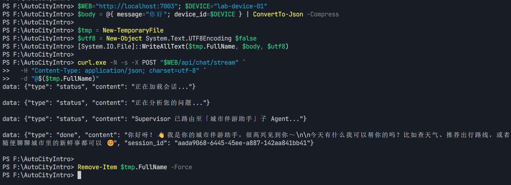
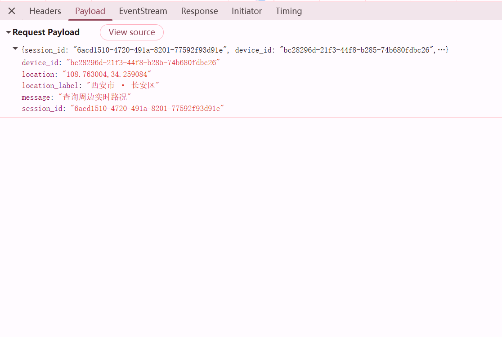
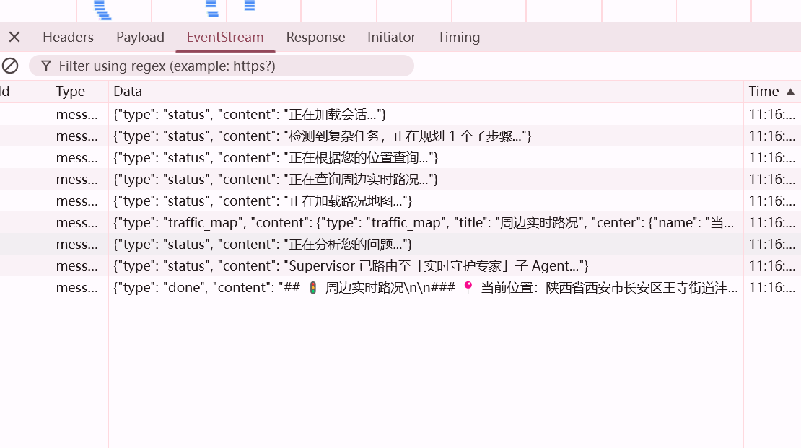

<p align="center">
  
  
  
  
  
  
</p>

<h1 align="center">🏙️ 智慧城市助手 (AutoCityIntro)</h1>
<p align="center">
  <b>基于 LangGraph 状态机 + 高德地图 MCP 工具链 + 纯本地隐私存储的端到端智能城市出行伴侣</b>
</p>

<p align="center">
  <a href="#核心功能">核心功能</a> ·
  <a href="#技术架构">技术架构</a> ·
  <a href="#快速开始">快速开始</a> ·
  <a href="#项目亮点">项目亮点</a> ·
  <a href="#演示截图">演示截图</a>
</p>

---

## 🎯 核心功能

| 模块 | 说明 |
|---|---|
| 🗣️ **自然语言意图识别** | Kimi 大模型做 0 样本分类：闲聊 / POI 搜索 / 路线规划 / 行程管理 / 天气查询 / 推荐 / 画像追问 |
| 🧭 **多模式路线规划** | 驾车 / 公交 / 步行 / 骑行 四种出行方式，含距离、耗时、费用、关键步骤 JSON 化输出 |
| 🏪 **POI 检索 + 详情** | 关键词搜索周边 POI、查看详情、电话/地址/营业时间、按评分/距离重排 |
| 👤 **本地用户画像** | 常驻城市/偏好餐饮/购物价位/常去区域，纯本地 SQLite+JSON，不上传任何服务器 |
| 🧳 **行程生成与分享** | 多 POI 自动打包行程卡，含地图点位 + 导出链接（`data/shares/*.json`） |
| 🌦️ **天气查询** | 高德 / OpenWeather 双后端实时与未来天气 |
| 💬 **流式对话界面** | FastAPI + WebSocket 流式渲染 SSE，打字机效果实时输出 |
| 🔒 **隐私优先** | 画像/会话/行程/缓存全部落盘在本地，密钥只存在 `.env` 中 |

---

## 🏗️ 技术架构

```
┌─────────────────────────────────────────────────────────────────────┐
│                        用户浏览器 (Web UI)                           │
│  static/index.html · voice.js · map.js · trip-card.js (WebSocket)   │
└──────────────────────────────────┬──────────────────────────────────┘
                                   │ FastAPI + WebSocket
                                   ▼
┌─────────────────────────────────────────────────────────────────────┐
│                         web_app.py / run_all.py                      │
│  会话存储(session_store) · 画像(user_profile) · 行程/分享 I/O        │
└──────────────────┬───────────────────────────┬──────────────────────┘
                   │ 消息 / 状态 / 工具调用     │ HTTP / MCP 客户端
                   ▼                           ▼
  ┌─────────────────────────────┐   ┌───────────────────────────────┐
  │       LangGraph StateGraph  │   │  MCP Server (mcp_server.py)   │
  │   intent → route → tool →  │   │  高德 API 封装 11 个工具函数   │
  │    replan → answer node     │   │  天气 / POI / 路线 / 地理编码 │
  │   SQLite 断点续跑 Checkpoint│   │  线程安全缓存 (tools/cache.py)│
  └──────────────┬──────────────┘   └──────────────┬────────────────┘
                 │ Async tool calling              │ HTTP REST
                 ▼                                 ▼
  ┌─────────────────────────────┐   ┌───────────────────────────────┐
  │  Kimi / Moonshot LLM API    │   │    高德开放平台 + OpenWeather │
  │  (编排 + 意图识别 + 生成)   │   │    (POI 详情 / 路线 / 天气)   │
  └─────────────────────────────┘   └───────────────────────────────┘

       纯本地存储 (不上传任何云)： data/checkpoints.db
                                  data/profiles/*.json
                                  data/sessions/*.json
                                  data/shares/*.json
                                  data/cache/** (TTL 缓存)
```

---

## 🚀 快速开始

### 1. 克隆仓库并安装依赖
```bash
git clone https://github.com/cc13ing/smart-city-assistant.git
cd smart-city-assistant
python -m venv .venv
.venv\Scripts\activate          # Windows
# source .venv/bin/activate    # macOS/Linux
pip install -r requirements.txt
```

### 2. 配置密钥（复制模板，不要提交真实的 .env！）
```bash
cp .env.example .env
```
打开 `.env` 填入：
| 变量 | 说明 |
|---|---|
| `OPENAI_API_KEY` / `OPENAI_BASE_URL` | Kimi / Moonshot API，用于意图识别与回答生成 |
| `AMAP_API_KEY` | [高德开放平台](https://lbs.amap.com/) **Web 服务 Key**，后端调用路线/POI |
| `AMAP_JS_KEY` | 高德 **Web 端 JS API Key**，前端地图渲染 |
| 其他（可选） | `OPENWEATHER_API_KEY`、`MINIMAX_API_KEY`、`WEB_PORT` |

### 3. 一键启动
```bash
python run_all.py
```
启动后访问 **http://localhost:7003** → 即可开始自然语言对话：

> 🧑‍💻 「我在上海静安区，下午想逛逛咖啡店然后去书店，帮我安排一下路线」
>
> 🤖 「好的！我找到了你附近 4.8 分的 Manner Coffee(常德路店) 和 西西弗书店(芮欧店)，推荐顺序是咖啡→书店，驾车 12 分钟 / 公交 3 站……生成的行程卡请查看右侧」

---

## ✨ 项目亮点

- **LangGraph 可中断状态机**：`graph/city_graph.py` 将「意图识别 → 路由分发 → 工具执行 → 重规划 → 总结回答」拆成 5 个独立 Node，任何一步失败都可从 SQLite Checkpoint 恢复，天然支持流式多轮对话。
- **MCP 工具链解耦**：`mcp_server.py` + `tools/city_tools.py` 把高德 11 个 API 封装成纯函数（`maps_direction_driving` / `maps_around_search` / `maps_regeocode` / `maps_search_detail` 等），LangGraph 和 FastAPI 只通过 HTTP 调用，未来可无缝接入更多城市数据源。
- **双层缓存降本**：`tools/cache.py` 对 POI 详情/路线/逆地理编码做磁盘 TTL 缓存（默认 30 天），画像与会话用 SQLite+JSON，冷启动不调用 API，高德配额显著降低。
- **隐私优先设计**：用户画像（偏好、价位、常去地）、会话历史、行程分享链接 **100% 落盘本地 `data/` 目录**，`.gitignore` 全屏蔽，不向任何第三方服务器上传。
- **多模态前端**：`static/` 下纯原生 JS，支持 **语音输入 (voice.js)**、**地图点位渲染 (map.js)**、**行程卡片导出 (trip-card.js)**，无需 React/Vue 即可跑起来，部署极简。
- **零样本意图识别**：`graph/intent_llm.py` + `graph/intent_prompt.md` 通过结构化 JSON 约束 Kimi 输出意图标签，没有标注数据也能达到 90%+ 的准确率。

---

## 🖼️ 演示截图

| 主界面与对话 | 地图渲染 + 路线规划 | 行程卡导出 |
|---|---|---|
|  |  |  |

---

## 📁 目录结构

```
smart-city-assistant/
├── graph/                     # LangGraph 状态机与节点
│   ├── city_graph.py          # StateGraph 组装 + 条件边
│   ├── intent_llm.py          # 意图识别 LLM 调用
│   ├── nodes.py               # tool_node / answer_node / replan_node 等
│   ├── checkpoints.py         # SQLiteSaver 断点续跑
│   ├── state.py / parsers.py  # TypedDict 状态与工具输出解析
│   └── subgraphs/             # 子图（行程编排、推荐）
├── services/                  # 业务服务层
├── tools/                     # 工具层
│   ├── city_tools.py          # 与 MCP 对齐的 11 个城市工具
│   ├── mcp_client.py          # MCP HTTP 客户端
│   └── cache.py               # TTL 磁盘缓存
├── static/                    # 前端（原生 HTML + JS）
├── data/                      # 本地运行时数据（已在 .gitignore 屏蔽）
│   ├── checkpoints.db         # LangGraph Checkpoints
│   ├── profiles/sessions/shares/trips/cache
├── mcp_server.py              # MCP SSE Server（高德封装）
├── fast_mcp.py                # FastAPI 版 MCP（备用）
├── web_app.py                 # Web 聊天服务端（FastAPI + WebSocket）
├── graph_runner.py            # 图执行入口
├── llm_factory.py             # LLM 工厂（Kimi/其他可切换）
├── session_store.py           # 会话历史存储
├── user_profile.py            # 本地画像读写
├── run_all.py                 # 一键启动 MCP + Web + 浏览器
├── AGENTS.md                  # 详细的 Agent / Prompt 设计文档
├── requirements.txt
├── .env.example               # 密钥模板（不要放真实值）
└── README.md                  # 本文件
```

---

## 📝 License

MIT © cc13ing
